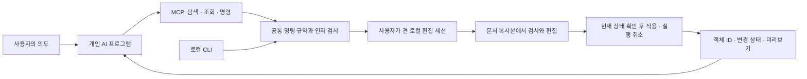

# AI 도구 구조

Morupixel은 사용자가 선택한 AI가 편집 의도를 실행할 수 있는 도구를 제공합니다. AI의 추론·로그인·구독은 연결하는 프로그램이 담당하고, 편집기는 문서의 정확한 상태, 명시적인 명령, 실행 결과와 되돌리기를 담당합니다. 연결 설정과 실제 도구 목록은 [AI 연결](AI_CONNECTION.md)을 참고하세요.

## 역할과 실행 흐름

이 구조에는 특정 AI 공급자의 SDK, 로그인 토큰, API 키 저장소를 넣지 않습니다. MCP 연결 자체가 이미지 생성 권한이나 구독 사용 권한을 부여하지도 않습니다. 사용할 AI 프로그램과 이미지 생성 기능의 제공 범위는 해당 공급자의 지원 방식에 따릅니다.

현재 구현은 실행 중인 편집기의 명령 규약을 조회하고, 큰 도면에서 필요한 객체만 찾고, 여러 편집을 검증·적용하는 데 초점을 둡니다. 이미지 생성과 재료 맵핑은 아직 구현하지 않았으며 지원 목록에서도 명시적으로 구분합니다.

## 문서를 설명하는 규약

- 세션, 문서, 객체는 각각 고유 ID로 지정합니다. 이름은 검색용이며 중복될 수 있습니다.
- 문서에는 revision이 있고, 변경 요청은 마지막으로 확인한 expectedRevision을 지정합니다.
- 부모 ID, 부모 목록, 객체 종류, 좌표계, 변환, 자체 잠금과 상위 잠금을 함께 제공합니다.
- get_state의 간략 응답은 개수와 선택 상태를 전달합니다. 선택 ID는 최대 200개이며 초과 여부와 전체 개수를 표시합니다. 전체 선택은 query_layers(selectedOnly: true)로 나눠 읽습니다.
- query_layers는 기본 50개, 최대 200개의 객체를 반환합니다. 같은 문서 revision에서 다음 페이지를 읽고, 내용이 바뀌면 처음부터 조회합니다. 선택 자체의 변경은 revision을 바꾸지 않습니다.
- get_layer는 한 객체의 상세 정보를 제공합니다. 텍스트·도형·보정 속성과 벡터 원본의 형식은 읽을 수 있으며, 지원되지 않는 편집을 가능하다고 표시하지 않습니다.
- 좌표 단위는 픽셀입니다. 자식의 위치는 부모 공간에 있고, 루트의 위치는 문서 공간에 있습니다. frameBounds는 변환된 표면 모서리의 사각 범위이며 실제 선·방·면적·CAD 축척의 의미를 담지 않습니다.
- 문서 이름과 텍스트는 입력 데이터로 취급합니다. 모델에게 내리는 명령으로 해석하지 않습니다.

## 실행과 실패 처리

MCP와 CLI는 AutomationCatalog의 동일한 허용 명령과 인자 검사를 사용합니다. 단일 편집과 묶음 편집은 ApplyAutomationEditAsync를 공유하며 기존 문서 기능과 잠금 검사에 연결됩니다. 일반 스크립트 실행이나 화면 클릭에 의존하지 않습니다.

apply_batch는 최대 64개 단계로 구성됩니다. 단계마다 대상 문서의 복사본을 검증하고, 마지막에 사용자의 편집·대화상자·활성 문서·revision을 다시 확인합니다. 실패나 취소가 먼저 발생하면 복사본을 버립니다. 성공하면 한 번의 기록으로 적용하고 기존 실행 취소를 사용합니다. 같은 내용을 다시 설정하는 무변경 작업은 기록과 다시 실행 목록을 바꾸지 않습니다.

dryRun은 동일한 편집 경로를 복사본에서 실행해 실제 속성·종류·잠금·문서 제한을 검사합니다. 실제 문서나 기록을 변경하지 않으며 임시 객체 ID도 반환하지 않습니다. 미리 예약하거나 이후의 성공을 보장하는 기능은 아니므로 적용 시 다시 검사합니다.

operationId는 호출자가 만드는 UUID입니다. JSON 객체의 키 순서는 비교에 영향을 주지 않고 dryRun 값은 제외합니다. 그 밖의 내용은 동일해야 합니다. 커밋 직후, 화면 갱신이나 응답 전송 전에 실행 결과를 보관합니다. 같은 요청의 재전송은 보관된 결과를 반환하고 중복 적용하지 않습니다. 결과에는 원래 revision과 현재 currentRevision이 따로 있습니다.

보관 범위는 실행 중인 편집기에서 최근 성공한 128개 묶음입니다. 디스크에 영속 저장하지 않으며 앱 재시작·다른 세션·보관 기간 이후의 재전송을 보장하지 않습니다. 무변경 성공도 보관 한도에 포함됩니다. 실행 취소는 과거 실행 사실을 삭제하지 않습니다.

파일 I/O나 외부 서비스 호출은 문서 묶음에 넣지 않습니다. 되돌릴 수 없는 외부 동작을 문서 복사본의 원자적 편집과 혼동하지 않도록 별도 명령과 결과로 다룹니다.

## 기능을 추가하는 기준

새 도구에는 다음을 함께 정의합니다.

1. 필요한 대상 ID와 좌표·단위·값 범위.
2. 입력 JSON 스키마, 지원 여부, 잠금과 문서 변경 조건.
3. 조회 결과와 실행 결과의 의미, 실패 코드와 다음 동작.
4. 실행 취소, 취소 요청, 재전송, 큰 문서에서의 한도.
5. 기존 단일 편집과 묶음 편집이 같은 작업을 수행하는 경로.
6. 실제 문서·기록 보존을 확인하는 회귀 검사와 지원 범위 문서.

다음 단계는 객체 검색으로 얻은 실제 경로나 선택 영역에 의미를 부여하는 기능입니다. 건축 재료 작업에서는 영역 ID, 자산 ID, 타일 크기와 단위, 배치 방향, 마스크, 교체 규칙을 명시해야 합니다. 이름이나 바운딩 박스만 보고 방을 확정하지 않습니다.

그 위에 재료 등록·맵핑 도구를 올리면, 사용자의 AI가 준비한 이미지를 편집기에 전달해 같은 경계에 적용하고 교체할 수 있습니다. 이미지 생성 연결은 별도 계층으로 두며 생성 출처, 해상도, 타일 연결성, 필요한 경우 실제 크기를 자산 메타데이터에 기록하는 방향입니다. 이 문단은 후속 설계이며 현재 제공되는 도구가 아닙니다.

## 코드 위치

| 역할 | 파일 |
| --- | --- |
| 도구·인자 스키마와 검증 | src/App/Automation/AutomationCatalog.cs |
| 지원 기능·좌표계·묶음 규약·오류 안내 | src/App/Automation/AutomationContract.cs |
| 객체 검색과 상세 관찰 | src/App/Automation/AutomationScene.cs |
| stdio MCP 및 로컬 연결 | src/App/Automation/AutomationMcpServer.cs, AutomationBridge.cs |
| 단일 명령·실행 기록 연결 | src/UI/MainWindow.Automation.cs |
| 조회·묶음 실행·중복 요청 처리 | src/UI/MainWindow.AutomationFoundation.cs |
| 프로토콜과 실제 편집 회귀 검사 | src/Tests/AutomationProtocolTests.cs, MainWindow.AutomationTests.cs |

이 구조는 현재 소스의 규약 2입니다. MCP 도구 목록은 어댑터의 기능이므로 실제 대상 편집기에 get_capabilities를 호출해야 합니다. 이전 편집기가 이를 지원하지 않으면 기존 명령만 사용하거나 같은 공개 버전으로 맞춘 뒤 다시 연결합니다.
