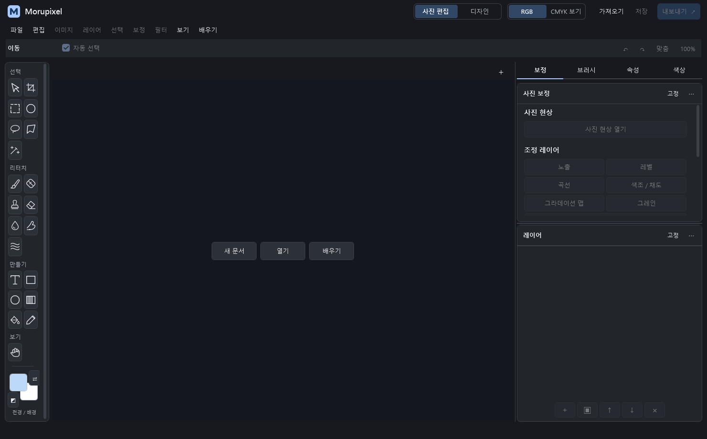
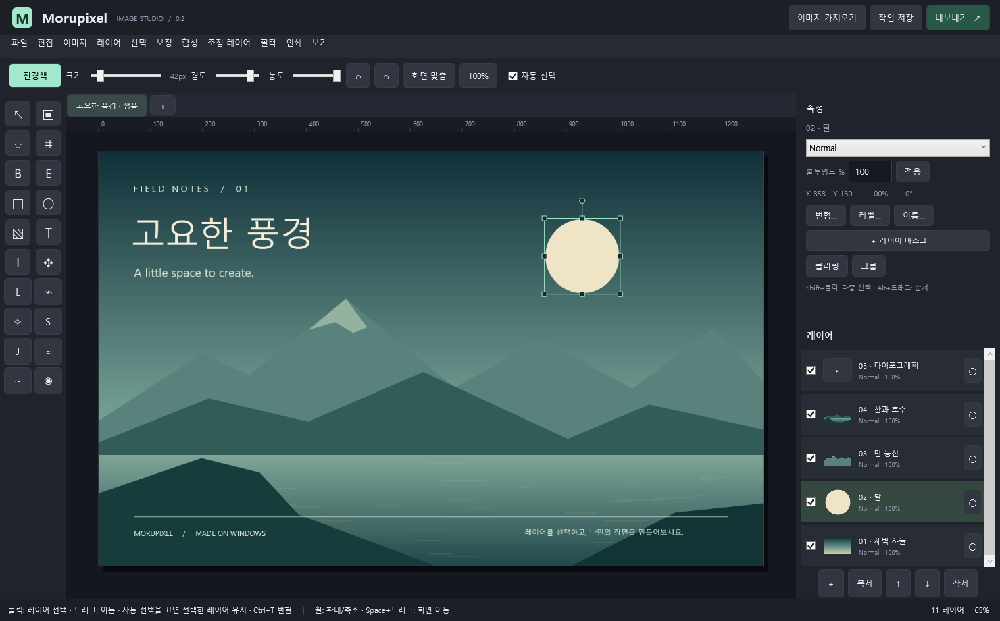

# Morupixel 사용·개발 안내

**0.2.0-preview.21 · Windows 10 2004 이상 / Windows 11 x64 · 독립 이미지 편집기**

**Preview 21:** DWG/DXF 가져오기의 **객체 구분**에서 **객체별 / 레이어별 / 전체**를 선택합니다. 기본은 객체별입니다. 폴리라인 사각형은 하나로, 독립된 선은 각각 선택하며 원본 레이어는 그룹으로 유지합니다. 기존에 합쳐서 가져온 문서는 원본 도면을 다시 가져오세요. [범위와 한도](FILE_COMPATIBILITY.md#cad-객체-구분--preview-21)

모루픽셀은 [Robbie Tilton / Wonder Assembly LLC의 Compositor](https://github.com/robbietilton/Compositor) 일부 코드와 알고리즘을 바탕으로 만든 Windows 이미지 편집기입니다. 독자적인 이름과 C#·WPF 구현을 사용하며 원작의 공식 Windows 제품이 아닙니다.

ZIP의 **모든 파일을 압축 해제한 뒤 `Morupixel.exe`를 실행**하세요. .NET 런타임과 로컬 AI 배경 제거 모델을 포함합니다. 사진 편집이나 AI 추론에 네트워크 연결이 필요하지 않습니다.

AI 배경 제거에는 [Microsoft Visual C++ x64 재배포 런타임](https://learn.microsoft.com/cpp/windows/latest-supported-vc-redist)이 필요합니다. 이미 설치되어 있으면 그대로 사용하고, AI 엔진을 불러오지 못한다는 안내가 나오면 공식 최신 x64 패키지를 설치하세요. 이 ZIP에는 해당 시스템 런타임 설치 프로그램이 포함되지 않습니다.

[파일 호환 안내](FILE_COMPATIBILITY.md) · [기능·호환성 비교](PORTING.md) · [변경 사항](RELEASE_NOTES.md) · [AI 모델 설명](BACKGROUND_REMOVAL.md) · [원작 출처](../NOTICE.md)

**Preview 9:** PDF·PDF 호환 Illustrator AI·RGB/회색조 8비트 PSD/PSB·DWG/DXF를 열고 미리보기를 확인해 가져올 수 있습니다. PDF는 페이지·DPI, CAD는 이미지 크기를 선택하며 PSD와 CAD는 제한된 레이어 분리를 지원합니다. PDF·PSD 출력도 추가했습니다. 원본 AI 벡터나 CAD 객체를 그대로 수정하는 기능은 아니며, 자세한 보존 범위는 [파일 호환 안내](FILE_COMPATIBILITY.md)를 확인하세요.

**Preview 10:** 오른쪽·분리 패널의 글꼴, 입력 높이, 여백과 구분선을 정리했습니다. 사진 편집은 보정·선택·리터치, 디자인은 문자·도형·색상·정렬·그룹을 우선 표시합니다. 디자인의 캔버스 정렬은 선택한 이미지·문자·도형 각각에 적용하며 한 번에 실행 취소할 수 있습니다.

**Preview 11:** `상세 변형 설정`, `레이어 이름 변경`처럼 명령 이름을 완전하게 표시하고, 속성 작업을 세로 행으로 정리했습니다. 중성색 패널·밑줄 탭·일관된 선택 색상을 적용했으며 오른쪽 패널의 왼쪽 경계를 드래그해 너비를 조절할 수 있습니다. [공식 UI 자료와 실제 공개 디자인 파일 조사](DESIGN_REFERENCES.md)에 근거와 접근 한계를 기록했습니다.

**Preview 12:** 이동 도구에서 선택한 이미지의 모서리는 대각선, 위·아래 손잡이는 세로, 좌·우 손잡이는 가로 크기 조절 커서를 표시합니다. 회전·뒤집기·부모 그룹 변형에 따라 화면에 보이는 방향을 반영하며, 조절 중에는 해당 손잡이의 커서를 유지합니다.

**Preview 13:** 원형·사각형·마름모·별과 직접 가져온 이미지로 브러시 모양을 바꾸고 회전·찍는 간격을 조절합니다. 색상 견본 아래에는 선택한 색을 기준으로 밝고 어두운 톤과 인접 색조를 고르는 격자를 추가했습니다. **필터 → 사진 현상 (Ctrl+Shift+A)**에서 화이트 밸런스·명암·질감·채도를 함께 조절하고, 다시 수정할 수 있는 조정 레이어로 적용합니다.

**Preview 14:** 상단 **보정 → 노출 / 레벨 / 채도 / 가우시안 흐림**에 숫자 입력과 연결된 슬라이더를 추가했습니다. 각 슬라이더의 **이동 간격**에서 연속 이동이나 **0.01 / 0.1 / 1 / 5**단위 눈금 맞춤을 선택합니다. 조정 레이어·사진 현상창에도 같은 간격 선택이 있으며, 선택 가능한 간격은 항목 범위에 맞춰 표시됩니다. 흐림 반경은 정수 픽셀로 조절합니다.

**Preview 15:** 디자인·보정·레이어·브러시·색상·텍스트 패널의 상시 설명문을 줄였습니다. 사용법은 툴팁으로 옮기고 기능명·값·단위·필수 변환 안내와 오류만 유지합니다. 하단 상태 표시도 도구명 중심으로 간소화했습니다.

**Preview 16:** 문서·이미지 없이 빈 작업 화면으로 시작합니다. **새 문서 / 열기 / 배우기**로 시작하며, 기존 바다 이미지 샘플은 **배우기 → 샘플 작업 열기**에서만 불러옵니다. 마지막 문서를 닫아도 빈 화면으로 돌아갑니다. 문서가 없으면 저장·내보내기는 비활성화되며, 이미지 열기·가져오기·붙여넣기는 이미지 크기의 문서로 시작합니다.

**Preview 17:** 문서를 닫을 때 저장 안내창도 앱의 어두운 테마로 표시합니다. 문서 이름을 확인하고 **저장 후 닫기 / 저장하지 않고 닫기 / 취소**를 선택할 수 있습니다. Esc나 X는 취소이며, 저장을 취소하거나 저장에 실패하면 문서를 유지합니다.

**Preview 18:** 이미지·캔버스 한도를 한 변 **65,535px**, 전체 **536,870,897픽셀(약 536.9MP)**, 레이어·마스크 합계 **8GiB**로 높였습니다. PDF·AI·PSD/PSB·DWG/DXF 입력은 최대 8GiB, `.moruproj`의 레이어별 PNG 항목은 최대 4GiB까지 허용합니다. 일반 이미지 열기에는 별도 파일 바이트 제한이 없습니다. 실제 처리 가능한 크기는 사용 가능한 메모리·코덱·작업에 따라 달라집니다. [상세 한도](FILE_COMPATIBILITY.md)





로고와 편집 화면에는 파우더 블루·네이비·아이보리 색상을 사용합니다. 배우기 샘플은 햇빛이 비치는 바다와 창가 이미지이며, 숨겨진 **선택형 타이포그래피** 그룹을 켜면 제목과 문구를 편집할 수 있습니다. 샘플 이미지는 실행 파일에 포함되어 별도 다운로드가 필요하지 않으며, 배우기를 선택했을 때 불러옵니다.

인터페이스는 영문·숫자에 **Segoe UI**, 한글에 **맑은 고딕**을 사용합니다. 기본 글자 13px, 보조 설명 12px, 섹션 제목 14px로 통일하고 입력칸은 내용에 맞게 높이가 늘어납니다. Pretendard 리소스와 라이선스도 계속 포함합니다. 상단 메뉴를 작업별로 묶고, 문서 탭에 닫기 버튼과 저장하지 않은 상태를 표시합니다. 오른쪽에서는 불투명도·위치·크기·회전을 바로 입력할 수 있습니다. Enter 또는 다른 항목으로 이동하면 적용하고, Esc로 입력을 되돌립니다. 레이어의 눈·잠금 아이콘은 레이어 선택과 독립적으로 동작합니다. [글꼴 출처와 라이선스](../assets/fonts/README.md)를 포함하며 기존 문서의 텍스트 서식은 유지합니다.

## Studio 인터페이스

중성색 표면, 얇은 구분선과 벡터 도구 아이콘으로 작업 영역을 정돈했습니다. 선택한 탭·모드·레이어에 파란색을 사용하고, 패널에서 큰 반사 장식과 축약된 명령 이름을 줄였습니다.

- 사진 편집에서는 **보정 / 브러시 / 속성 / 색상**, 디자인에서는 **디자인 / 속성 / 색상 / 브러시** 순서로 패널을 배치합니다. 사진 모드는 히스토그램·선택·리터치·조정 레이어, 디자인 모드는 문자·도형·정렬·그룹·색상 작업을 우선 제공합니다.
- 상단 **사진 편집 / 디자인** 선택기는 누른 이름에 해당하는 도구 그룹·작업 바로가기·패널 순서를 표시합니다. 디자인은 히스토그램을 접어 작업 공간을 넓힙니다. 사진·텍스트·도형을 같은 문서에서 함께 편집하며, 모드를 바꿔도 레이어·선택·실행 취소는 유지됩니다. **RGB / CMYK 미리보기**는 별도의 선택기입니다.
- RGB 히스토그램은 현재 합성 이미지의 투명도를 고려하여 계산합니다. 큰 이미지는 최대 약 65,536개 픽셀을 표본으로 사용합니다.
- 보정창에는 히스토그램, 색상 슬라이더, 숫자 입력과 개별 초기화가 있습니다. 미리보기 확인 후 조정 레이어로 적용합니다.
- 색상 견본 27개 아래에는 **선택 색상 톤 격자**, 연속적인 **채도·명도 팔레트**와 색조 막대가 있습니다. 현재 전경색에 맞춰 **보색 / 유사색 / 삼각색** 조합을 추천하며, 추천색을 누르면 전경색에 적용합니다. 브러시에서는 크기·경도 프리셋과 모양·회전·찍는 간격을 조절합니다.
- **Ctrl+N**: 현재 Windows 화면, FHD·QHD·4K·HD, A2·A3·A4·A5. px/mm, DPI, 배경을 지정합니다. 용지는 기본 150 DPI이며 A4/A5는 300 DPI도 설정할 수 있습니다. A2/A3의 300 DPI는 현재 1,677만 픽셀 한도를 초과합니다.
- 상단 **RGB / CMYK 미리보기** 또는 **Ctrl+Shift+Y**로 인쇄색을 전환합니다. 보기 메뉴에서 CMYK ICC 프로필을 선택하고 파일 메뉴에서 같은 프로필로 CMYK TIFF를 출력합니다. RGB 원본 픽셀과 레이어는 유지되며 CMYK 미리보기의 투명 영역은 흰색 용지로 표시됩니다.
- **패널 제목 드래그**로 보정·속성·색상·브러시·레이어를 분리해 이동합니다. 제목의 **⋯**에서 좌우 도킹, **고정**에서 제목 드래그를 잠글 수 있습니다. 패널 창을 닫으면 오른쪽으로 복귀합니다. **보기 → 패널 배치 초기화**로 기본 배치에 돌아갑니다. 배치는 현재 실행 세션에 유지됩니다.
- 오른쪽 패널 왼쪽 경계를 드래그하면 너비를 324~520 DIP 범위에서 조절합니다. 경계를 두 번 클릭하면 기본 396 DIP로 돌아갑니다. 경계에 키보드 초점이 있으면 좌우 방향키로 조절합니다.
- **레이어 행을 일반 드래그**하여 표시선 위·아래에 놓습니다. 그룹 가운데에 놓으면 그룹에 들어갑니다. Ctrl+Z로 순서를 되돌릴 수 있습니다.
- Windows 11 제목 표시줄도 어두운 편집 화면에 맞춰 표시됩니다.
- 속성 라벨과 버튼은 공간에 맞게 줄바꿈하고, 문자·색상 등 긴 패널은 세로로 스크롤합니다. 분리한 패널 창의 기본 크기와 입력 높이도 넓혀 작은 글자가 잘리지 않도록 조정했습니다.

패널 스타일 자체는 편집하는 사진의 색이나 선명도를 바꾸지 않습니다. 사진 현상은 디코딩된 RGB 이미지의 보정 기능이며, 카메라 RAW 파일 해독은 지원하지 않습니다. 필압·스트로크 안정화와 특정 색상 범위만의 색조 보정도 미지원입니다.

## 편집 기능

| 영역 | 제공 기능 |
| --- | --- |
| 작업 공간 | 사진 편집/디자인 전환, 같은 문서의 이미지·텍스트·도형 혼합 편집, 문서 탭 최대 8개, 확대/이동, 안내선·스냅, 실행 취소/다시 실행 |
| 레이어 | 레이어 그룹, 순서·이름·표시·잠금·불투명도, 14개 혼합 모드, 여러 레이어 선택·변형 |
| 변형 | 이동·회전·비균일 크기 조절·뒤집기, 네 꼭짓점 원근 왜곡 |
| 마스크 | 래스터 마스크, 그룹 마스크, 아래 레이어에 클리핑, 브러시로 수정 |
| 선택 | 사각·타원·올가미·다각형·마술봉, 추가·빼기·교차·반전, 페더·확장·축소, 알파 선택 |
| 그리기·보정 | 기본 모양·사용자 이미지 브러시, 회전·찍는 간격, 지우개·복제 도장·복구·스머지·액화·흐림 브러시, 버킷 채우기·도형·그라데이션, 내용 인식 채우기 |
| 텍스트 | 속성 패널에서 내용·글꼴·크기·굵게·기울임·색상·행간·자간, 단락 정렬·캔버스 정렬 |
| 벡터 도형 | 편집 가능한 사각형·타원, 채우기·선 색상과 표시, 선 두께·둥근 모서리, 크기·변형·마스크 |
| 조정 레이어 | 사진 현상 13개 조절값, RGB 전체·빨강·초록·파랑 채널별 레벨·곡선, 색조/채도, 노출·오프셋·감마, 그라디언트 맵, 그레인 |
| 필터 | 가우시안·모션 흐림, 노이즈·렌즈 왜곡 등 |
| 배경 제거 | 번들 U²-NetP 모델을 Microsoft ONNX Runtime CPU로 실행, 결과를 수정 가능한 마스크로 적용 |
| 이미지 파일 | PNG/JPEG/BMP/TIFF/GIF, EXIF 방향 보정, 내장 ICC→sRGB 변환, Windows 코덱이 설치된 HEIC/HEIF |
| 호환 파일 | PDF·PDF 호환 AI의 페이지 이미지, RGB/회색조 8비트 PSD/PSB의 합성 이미지 또는 기본 픽셀 레이어, DWG/DXF의 2D 모델 공간 이미지 |
| 내보내기 | 전체 문서 또는 선택 레이어를 PNG·TIFF·품질 조절 JPEG로 출력, 내용에 맞게 자르기/전체 캔버스, 파일 크기·이미지 미리보기 |
| 인쇄용 출력 | ICC 프로필을 포함한 CMYK TIFF, 프로필 변환 미리보기·DPI 설정 ([사용 안내](CMYK.md)) |
| PDF / PSD 출력 | 문서 DPI의 한 페이지 이미지 PDF, 합성 PSD 또는 기본 픽셀 레이어 PSD ([지원 범위](FILE_COMPATIBILITY.md)) |
| 작업 저장 | `.moruproj` 버전 2, 이전 `.cwproj` 버전 1/2 읽기, 원본 `.comp` 일부 기능 가져오기/내보내기 |

## 브러시와 색상

- 오른쪽 **브러시 → 브러시 모양**에서 원형·사각형·마름모·별을 선택하거나 **이미지로 브러시 추가**를 누릅니다. PNG/JPEG/BMP/TIFF를 지원하며, 투명 이미지는 알파를, 완전히 불투명한 이미지는 어두운 부분을 모양으로 사용합니다. 원본 이미지의 색 대신 전경색으로 그립니다. 브러시·지우개와 마스크 그리기에 모양을 적용하며 **모양 회전**, **찍는 간격**으로 연속 선 또는 간격 있는 도장을 만듭니다.
- 가져오는 브러시 파일은 **32 MiB 이하**이며 원본 이미지 한도가 적용됩니다. 비율을 유지하여 긴 변 최대 **256px**의 작은 모양으로 저장합니다. 사용자 모양은 `%LOCALAPPDATA%\Morupixel\Brushes`에 보관해 다음 실행에서 다시 선택할 수 있습니다. 작업 파일에 포함된 라이브 브러시가 아니라 개인 브러시 라이브러리이며, 이미 그린 획은 문서 픽셀로 저장됩니다.
- 브러시·지우개·복구 도구에서 **Alt + 마우스 왼쪽 또는 오른쪽 버튼 드래그**: 오른쪽으로 크기 증가, 왼쪽으로 감소 (1~1,000px). 크기 미리보기가 표시되며 Esc로 원래 크기로 되돌립니다.
- 복제 도장·복구 브러시의 **Alt+클릭**은 원본 위치를 지정합니다. Alt 드래그로 크기를 바꿀 때 기존 원본 위치는 유지됩니다.
- 왼쪽 도구막대의 겹친 색상 칸을 클릭하여 전경색·배경색을 각각 선택합니다. 색상창은 채도·명도 영역, 색조 막대, RGB·알파·HEX 입력을 제공합니다.
- 오른쪽 **색상** 탭의 **선택 색상 톤**은 현재 색을 가운데에 두는 9열×7행 격자입니다. 위쪽은 밝은 톤, 아래쪽은 어두운 톤, 좌우는 인접 색조이며 무채색을 고르면 무채색 단계로 표시합니다. 격자 안의 색을 시험하는 동안 기준 격자를 유지하고, **현재 색을 기준으로**를 누르면 다시 구성합니다. 다른 견본·색상 선택기로 전경색을 바꿔도 격자가 갱신됩니다.
- 격자 아래의 연속 채도·명도 팔레트도 별도 창 없이 드래그할 수 있습니다. 팔레트에 포커스를 두고 방향키로 1%, Shift+방향키로 10%씩 조절합니다. 추천 조합의 HEX 칩을 클릭하면 전경색으로 선택합니다. 추천색은 색상환 관계를 이용하며, 인쇄 출력 색상은 선택한 ICC 프로필의 영향을 받습니다.
- **X**: 전경색·배경색 교환. **D**: 검정·흰색 초기화. **Alt+Delete / Ctrl+Delete**: 전경색 / 배경색으로 채우기. Alt+Backspace / Ctrl+Backspace도 같은 동작입니다. 선택 영역이 있으면 그 안에만 적용되며, Delete만 누르면 픽셀을 지웁니다.
- **G**: 버킷 채우기. 허용 오차(0~255), 연결 영역만 채우기, 보이는 레이어를 경계로 사용하기, 농도를 조절할 수 있습니다. 현재 픽셀 레이어에 채우며 Ctrl+Z로 취소합니다. 이미지의 색상 경계를 사용하는 래스터 방식으로, Illustrator의 편집 가능한 벡터 Live Paint와는 다릅니다.
- **Shift+G**: 그라데이션. 텍스트 도구(**T**)로 빈 곳을 클릭하면 텍스트 레이어와 **문자·단락 속성 패널**이 열립니다. 기존 텍스트를 클릭하면 같은 패널에서 다시 편집합니다.
- 색상 추출 도구에서 클릭하면 전경색, Alt+클릭하면 배경색을 지정합니다. 그라데이션 옵션에서 전경색→투명 또는 전경색→배경색을 선택합니다.

## 사진 현상

**필터 → 사진 현상**, **Ctrl+Shift+A**, 또는 사진 편집 패널의 **사진 현상 열기**를 사용합니다. 빛·색상·디테일 구역에서 다음 13개 값을 조절합니다.

- 빛: 노출 EV, 대비, 밝은 영역, 어두운 영역, 흰색 계열, 검정 계열
- 색상: 상대 색온도, 녹색/자홍 색조, 생동감, 채도
- 디테일: 텍스처, 부분 대비, 안개 제거

노출은 -5~5 EV, 나머지는 -100~100 범위입니다. **보정 결과 보기**를 끄면 보정 전과 비교하고, 개별 초기화 또는 **현상 설정 모두 초기화**로 되돌립니다. 적용하면 원본 픽셀을 보존하는 조정 레이어가 생기며 선택 영역은 마스크로 반영됩니다. 레이어를 다시 편집하거나 표시를 끄고, Ctrl+Z로 취소할 수 있습니다. `.moruproj`는 모든 조절값을 보존합니다.

Camera Raw와 유사한 보정 항목을 갖춘 **RGB 8비트 이미지 필터**입니다. 카메라 RAW 센서 데이터 해독, Kelvin 기반 RAW 화이트 밸런스나 Adobe 알고리즘과 동일한 결과를 제공하지 않습니다. 이 조정이 있는 문서의 편집 가능한 `.comp` 출력은 지원하지 않으므로 `.moruproj`로 저장하거나 합성 이미지·PDF·합성 PSD로 출력하세요.

## 문자·도형과 선택 레이어 출력

텍스트의 **내용, 글꼴, 스타일, 크기, 줄 간격, 자간, 색상**을 속성 패널에서 조절합니다. 줄 간격은 px 단위이며 0은 자동, 자간은 1/1000 em 단위이며 0은 기본입니다. 단락은 왼쪽·가운데·오른쪽으로 정렬하고, 텍스트 레이어는 캔버스의 네 변 또는 가로·세로 중앙에 정렬할 수 있습니다.

텍스트 내용 입력칸에서 **Enter는 줄바꿈**, **Ctrl+Enter 또는 텍스트 적용 버튼은 내용과 서식 적용**입니다. 크기·줄 간격·자간 같은 숫자 입력칸에서는 **Enter로 적용**합니다. 글꼴 목록이 열린 동안의 Enter는 목록 선택에 사용하며, 한글 조합 중 Enter도 조합 확정에 사용할 수 있습니다. 문서나 선택 레이어를 바꾸면 이전 대상에 입력이 잘못 적용되지 않도록 검사합니다.

사각형·타원은 **벡터 도형 레이어**로 생성됩니다. 속성에서 너비·높이, 채우기와 선의 색상·표시, 선 두께, 사각형의 둥근 모서리를 다시 변경할 수 있습니다. 도형 정의는 `.moruproj`에 저장하며, 직접 확대할 때 정의된 도형을 대상 해상도로 그립니다. 브러시나 픽셀 필터로 도형을 수정하면 픽셀 레이어로 전환하고 Ctrl+Z로 되돌릴 수 있습니다.

**파일 → 선택 레이어 이미지로 내보내기…**에서 하나 또는 여러 레이어를 하나의 이미지로 출력합니다. **내용에 맞게 자르기 / 전체 캔버스 크기**, PNG·JPEG·TIFF, JPEG 품질을 선택하고 미리보기와 예상 용량을 확인합니다. PNG/TIFF는 투명도를 보존하고 JPEG는 흰색 배경으로 출력합니다. 출력 DPI는 문서 설정을 사용합니다.

선택한 레이어는 표시하여 출력하고, 선택한 그룹은 표시된 하위 레이어를 포함합니다. 변형·마스크·부모 그룹 속성은 유지하되 선택하지 않은 배경과 조정 레이어는 제외하므로 합성 결과가 달라질 수 있습니다. 클리핑 기준 레이어가 선택되지 않았으면 독립 이미지로 출력한다는 안내를 표시합니다. 캔버스 밖 영역은 출력 범위에 포함되지 않습니다.

## 원작과의 차이

이 버전은 기능을 확장한 개발 프리뷰입니다. **원작과 모든 기능·화질·속도가 같다는 검증을 마친 제품은 아닙니다.** 세부적인 색 처리와 마스크·그룹 렌더링, 텍스트 줄바꿈, 복구 및 내용 인식 채우기 결과는 원작과 다를 수 있습니다.

- 그룹은 분리 합성 방식입니다. 원작의 패스스루 그룹과 혼합 결과가 다를 수 있습니다.
- 텍스트의 고정 너비 문단 상자·자동 줄바꿈·양쪽 맞춤, 색상 범위별 HSV, 일부 레이어 효과·라이브/연결 해제 마스크는 미지원입니다.
- 벡터 편집은 사각형·타원과 해당 속성으로 제한됩니다. SVG 가져오기/내보내기, 베지어 경로·앵커 편집, 도형 합치기/빼기 같은 경로 연산, 완전한 Figma 또는 Illustrator 기능은 제공하지 않습니다. 그룹은 내부 내용을 래스터 합성하므로 그룹 전체를 확대할 때 직접 확대하는 벡터 도형과 선명도가 달라질 수 있습니다.
- `.comp` 상호 변환은 지원 부분만 제공합니다. 도형과 자간·줄 간격을 설정한 텍스트는 외형을 유지하는 픽셀 이미지로 출력하며 안내를 표시합니다. 편집 가능한 도형과 확장 문자 속성은 `.moruproj`로 보관하세요. 텍스트를 수정할 때 OS별 글꼴 차이가 발생할 수 있습니다.
- AI 배경 제거는 320×320 U²-NetP를 사용합니다. 머리카락·털·투명 물체·복잡한 배경은 수동 마스크 수정이 필요할 수 있습니다. Apple Vision과 같은 모델이나 결과는 아닙니다.
- 완전한 PSD/AI/CAD 편집 속성, CMYK 편집, 16/32비트 작업 공간, 일반 이미지 원본 ICC/PPI 메타데이터 보존, HEIC 내보내기는 미지원입니다. PSD 해상도와 PDF 출력 DPI는 지원합니다. GIF/TIFF 등 다중 프레임 파일은 첫 프레임을 사용합니다.
- 한 변 65,535px, 총 536,870,897픽셀, 최대 128개 레이어와 레이어 픽셀/마스크 합계 8GiB 제한이 있습니다. 가로·세로와 전체 픽셀 제한을 모두 만족해야 합니다. 실행 취소는 최대 50개 항목과 별도 보관 픽셀 192MiB 범위여서 큰 편집은 기록을 남기지 못할 수 있습니다. 디코딩·합성·편집에는 추가 버퍼가 필요하며 실제 처리 가능한 크기는 사용 가능한 메모리에 따라 달라집니다. PSD 출력은 한 변 30,000px의 형식 한도를 유지합니다.

## 빌드와 검증

Windows와 .NET 8 SDK가 필요합니다. 첫 복원 시 공식 NuGet에서 ONNX Runtime을 받습니다. 모델은 `models/`에 체크섬과 라이선스를 포함해 보관합니다.

```powershell
.\scripts\Build.ps1
.\scripts\Test.ps1
.\scripts\Publish.ps1 -Version 0.2.0-preview.18
```

배포 파일은 `release\Morupixel-0.2.0-preview.18-win-x64.zip`입니다. 패키징 스크립트는 모델 SHA-256을 확인하고 실제 배포 EXE의 자동 테스트도 실행합니다. [소스 구조](ARCHITECTURE.md)에서 엔진·화면·입출력·테스트의 위치와 편집 규칙을 확인할 수 있습니다.

개발 빌드는 Windows x64용이며 설치된 .NET 8 Desktop Runtime을 사용합니다. 배포 ZIP은 .NET을 포함합니다. 개발 테스트 결과는 `artifacts\test-results`, 배포판 테스트 결과는 `artifacts\published-self-test`에 저장하고 `release`에는 버전별 배포 파일을 보관합니다. 사용 중인 버전의 폴더를 다시 만들지 말고 새 버전으로 배포하세요. 스크립트는 실행 중인 프로그램이 사용하는 경로의 삭제를 거부하며 프로그램을 종료하지 않습니다.

[파일 정리·용량 점검](MAINTENANCE.md)에는 폴더 용도와 캐시 정리 방법을 정리했습니다. `scripts\Maintain.ps1`은 기본적으로 용량만 조사하며, `-CleanBuildCaches`를 지정했을 때 재생성 가능한 빌드 폴더를 정리합니다. 개발은 사용자의 데스크톱 작업을 방해하지 않는 백그라운드 방식으로 진행합니다.

```powershell
.\Morupixel.exe --self-test .\self-test.txt
.\Morupixel.exe --render-preview .\preview.png
```

`--render-preview`는 창을 표시하지 않고 WPF 화면 레이아웃을 이미지로 그리는 개발 검증입니다. 실제 마우스/키보드 조작 검증을 대체하지 않습니다. [검증 기록](VALIDATION.md)은 해당 버전과 검증 방식을 구분합니다.

원작 MIT 고지는 [LICENSE](../LICENSE), 제품 관계는 [NOTICE.md](../NOTICE.md), 의존성·모델 고지는 [THIRD_PARTY_NOTICES.md](../THIRD_PARTY_NOTICES.md)에 있습니다. 저장소 주소에 남아 있는 `compositor-windows`와 내부 네임스페이스는 이전 버전의 개발 식별자이며 제품명은 Morupixel입니다.
